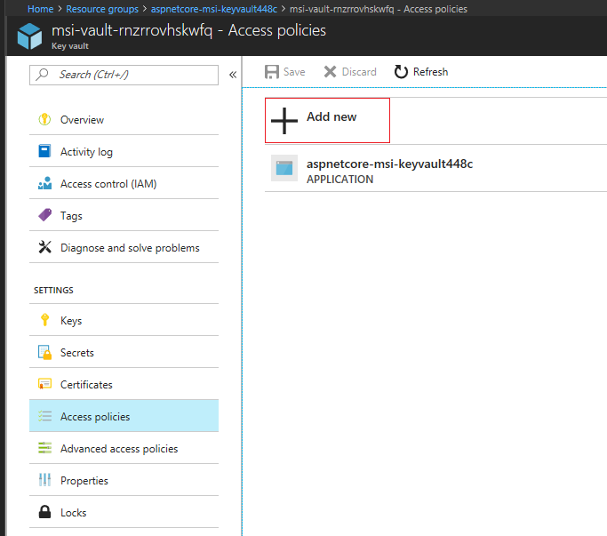
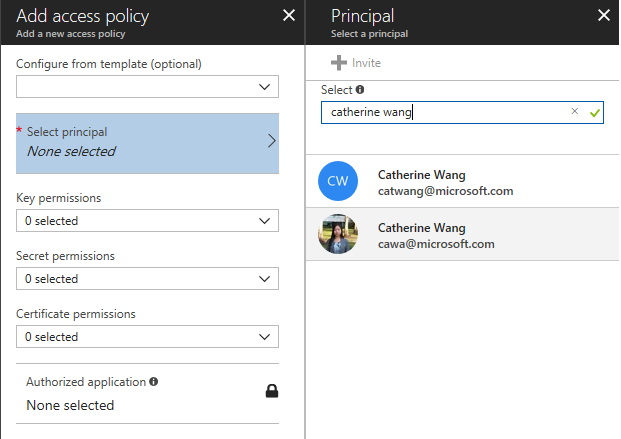
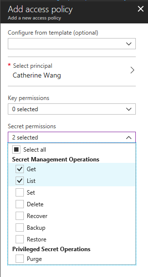
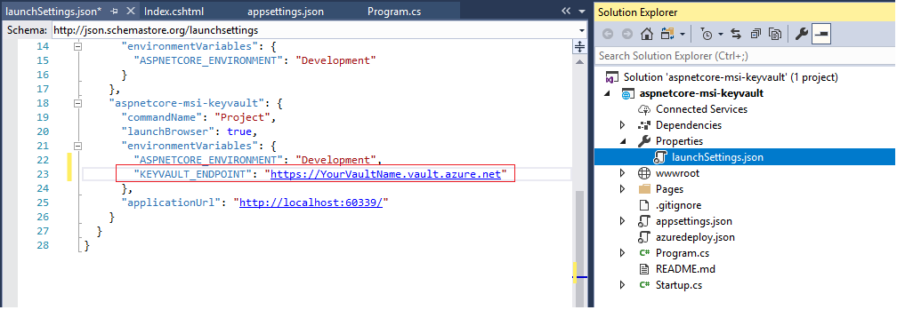
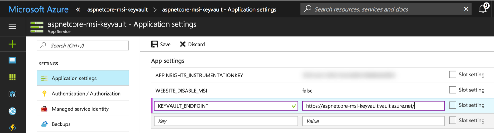

# How to use Managed Service Identity to access Azure Key Vault from ASP.NET Core

## Overview

This sample demonstrates how to securely access an Azure resource such as Key Vault using Visual Studio sign-in identity during development, and using [Managed Service Identity](https://docs.microsoft.com/en-us/azure/active-directory/msi-overview) on Azure.


## Pre-requisites to run this sample
* [Visual Studio 2017](https://www.visualstudio.com/)
    * Install [todo: workloads needed]
* [Azure Services Authentication Extension](https://go.microsoft.com/fwlink/?linkid=862354)
* Download or clone this repository and open the project in Visual Studio
* An Azure subscription. [Create your Azure free account today](https://azure.microsoft.com/en-us/free/)

## How to debug this application locally

1. Deploy the following resources to your Azure subscription by clicking the button below
    * Azure App Services
    * Azure Key Vault
    * Two secrets in the Key Vault

    [](https://azuredeploy.net/)

2. Go to your Key Vault resource on Azure portal. Browse to *Access policies* and add yourself to have secret Get and List permissions.







2. Obtain the Key Vault URL from Azure portal and put it in the launchsettings.json file


    ```
        "KEYVAULT_ENDPOINT": "https://[NameOfYourKeyVault].vault.azure.net/"
    ```


3. F5 or from menu select *Debug | Start Debugging*. The app should run successfully using the secrets from Key Vault.

### How did the app access Key Vault during debugging session
The [Azure Services Authentication Extension](https://go.microsoft.com/fwlink/?linkid=862354) allows the web app to use the Visual Studio sign-in identity to access Azure Key Vault

## How to deploy this application to Azure
The *Deploy to Azure* button above deploys a template that makes sure Azure App Services Managed Services Identity (MSI) is enabled, and Key Vault access policy is configured to allow the App Services to access the Key Vault. This makes sure when the web app runs in the App Services, it can use the MSI to access Key Vault.

1. Go to the App Services in the resource group you created earlier. Select App Settings and add the Key Vault URL



2. Right click on the project and launch the publish dialog to deploy the web app to the your App Services resource in the resource group you created earlier.


Article: https://anthonychu.ca/post/secrets-aspnet-core-key-vault-msi
