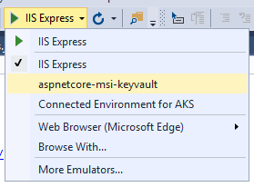
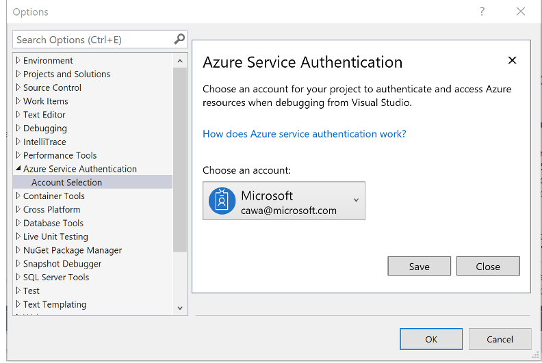
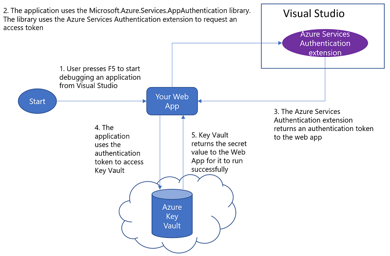

# How to use Managed Service Identity to access Azure Key Vault from ASP.NET Core

## Overview

This sample demonstrates how to securely access an Azure resource such as Key Vault using Visual Studio sign-in identity during development, and using [Managed Service Identity](https://docs.microsoft.com/en-us/azure/active-directory/msi-overview) on Azure.


## Pre-requisites to run this sample
* [Visual Studio 2017 Update 5](https://www.visualstudio.com/downloads/)
    * Install *.NET core cross-platform development* workload
* [Azure Services Authentication Extension](https://go.microsoft.com/fwlink/?linkid=862354). To go Visual Studio *Tools | Extensions and Updates* and search for *Azure Services Authentication* online to install the extension.
* Download or clone this repository and open the project in Visual Studio
    ```
    git clone https://github.com/CawaMS/aspnetcore-msi-keyvault.git
    ```
* An Azure subscription
    * [Create your Azure free account today](https://azure.microsoft.com/en-us/free/)

## How to debug this application locally

1. Deploy the following resources to your Azure subscription by clicking the button below
    * Azure App Services with [Managed Service Identity (MSI)](https://docs.microsoft.com/en-us/azure/app-service/app-service-managed-service-identity)
    * Azure Key Vault
    * Two secrets in the Key Vault

    [](https://azuredeploy.net/)

2. Go to your Key Vault resource on Azure portal. Browse to *Access policies*. Grant yourself Secret Get and List permissions.


Save the access policy by clicking *Save* on the top left corner in the menu bar of current blade.

2. Obtain the Key Vault URL from Azure portal. Save it in the environment variable section in launchsettings.json file, under a profile in the profiles section. If you only save it under one profile, for example, the *aspnetcore-msi-keyvault* profile, you will need to choose this profile when running in debug.


    ```
        "KEYVAULT_ENDPOINT": "https://[NameOfYourKeyVault].vault.azure.net/"
    ```




3. (Optional) If you need to use an account that is different from the Personalization account in the top right corner of Visual Studio, to go to *Tools | Options | Azure Service Authentication | Account Selection*



4. Press F5 or select *Debug | Start Debugging* from tool bar in Visual Studio. The app should display the secrets from Key Vault.

### How did the app access Key Vault during debugging session
During startup the app uses Visual Studio sign-in identity to access Key Vault and pulls secret settings to the process memory so the app runs successfully.



The [Azure Services Authentication Extension](https://go.microsoft.com/fwlink/?linkid=862354) allows the app to access Azure Key Vault using Visual Studio sign-in identity

## How to deploy this application to Azure

1. In Azure portal, navigate to the App Services you created earlier. Select App Settings and add the Key Vault URL


2. Right click the project and launch the publish dialog. Deploy the web app to the your App Services resource created earlier.


## Learn more about securely developing Azure applications

* [Announcement: Developing Web Apps without Secrets in Source Code in Visual Studio](https://go.microsoft.com/fwlink/?linkid=862656)
